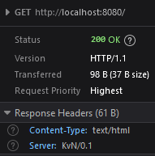

# parsing

a naïve approach to parsing an http request. 
it will set up a tcp listener on 8080 and is only able to parse the request line and any following headers.

I also experimented with the idea of a `Must` function in Go. I could see how this might work to corral dependent operations together but 🤷

an example GET request could look like

```
GET /some-path HTTP/1.1
Host: localhost:8080
User-Agent: curl/7.81.0
Accept: */*
```

which this piece of code should be able to parse and reply with a HTTP response.

from `curl`, the reply looks something like this:

```
ngynkvn@Kep ~/http (main)> time curl localhost:8080 -v
*   Trying 127.0.0.1:8080...
* Connected to localhost (127.0.0.1) port 8080 (#0)
> GET / HTTP/1.1
> Host: localhost:8080
> User-Agent: curl/7.81.0
> Accept: */*
> 
* Mark bundle as not supporting multiuse
< HTTP/1.1 200 OK
< Server: KvN/0.1
< Content-Type: text/html
* no chunk, no close, no size. Assume close to signal end
< 
* Closing connection 0
THERE WERE 3 HEADERS, Kevin WAS HERE
________________________________________________________
Executed in    4.67 millis    fish           external
   usr time    4.43 millis  182.00 micros    4.25 millis
   sys time    0.22 millis  216.00 micros    0.00 millis

```

some of the comments from `curl -v` are interesting :-)

Hey, it even worked opening it from chrome:

 